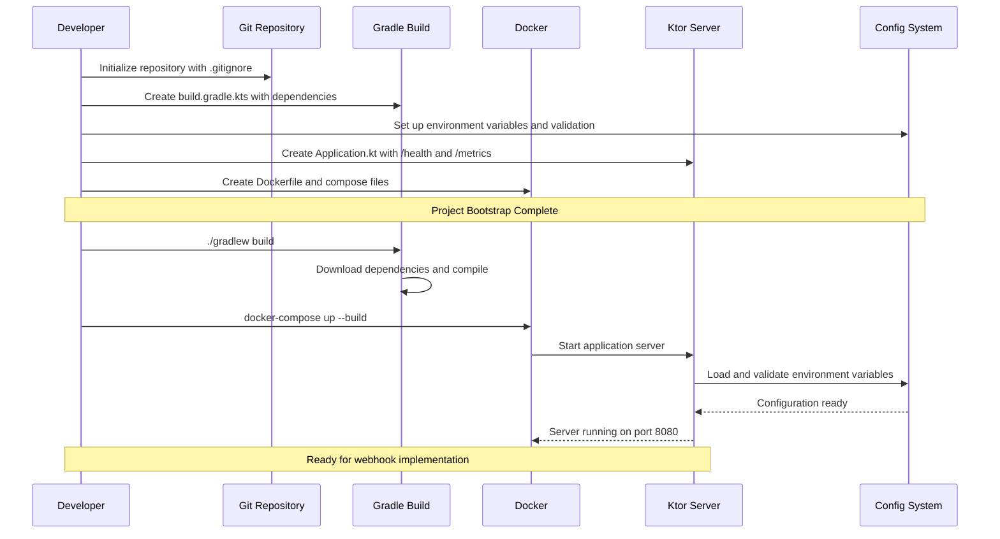

# Project Bootstrap Sequence

This document describes the initialization and startup sequence for the Telegram Voice Bot project.

## Bootstrap Flow Diagram

## Phase Breakdown

### 1. Development Setup Phase
- **Git Initialization**: Repository setup with proper .gitignore for Kotlin/Docker projects
- **Gradle Configuration**: Build system setup with JDK 21 and all required dependencies
- **Environment Setup**: Configuration management with secret masking and validation
- **Application Structure**: Ktor server with admin endpoints (/health, /metrics)
- **Containerization**: Docker multi-stage build and Compose orchestration

### 2. Runtime Initialization Phase
- **Build Process**: Gradle downloads dependencies and compiles Kotlin source
- **Container Startup**: Docker builds image and starts services
- **Server Launch**: Ktor initializes Netty engine on port 8080
- **Configuration Loading**: Environment variables loaded and validated
- **Ready State**: Application ready to receive webhook requests

## Key Components

| Component | Role | Dependencies |
|-----------|------|--------------|
| **Git Repository** | Version control and project structure | None |
| **Gradle Build** | Dependency management and compilation | JDK 21 |
| **Config System** | Environment variable management | System environment |
| **Ktor Server** | HTTP server and routing | Config, Gradle dependencies |
| **Docker** | Containerization and orchestration | Dockerfile, Compose files |

## Critical Points

1. **Configuration Validation**: Application exits early if required environment variables are missing
2. **Security**: All secrets are masked in logs and validated at startup
3. **Health Checks**: `/health` endpoint available immediately for monitoring
4. **Graceful Startup**: Clear error messages if setup is incomplete

## Next Steps

After this bootstrap sequence completes, the project is ready for:
- Telegram webhook implementation
- Database initialization and migrations  
- Admin command handlers
- Voice processing pipeline
- ElevenLabs API integration

This diagram will be updated as new components are added to the system.